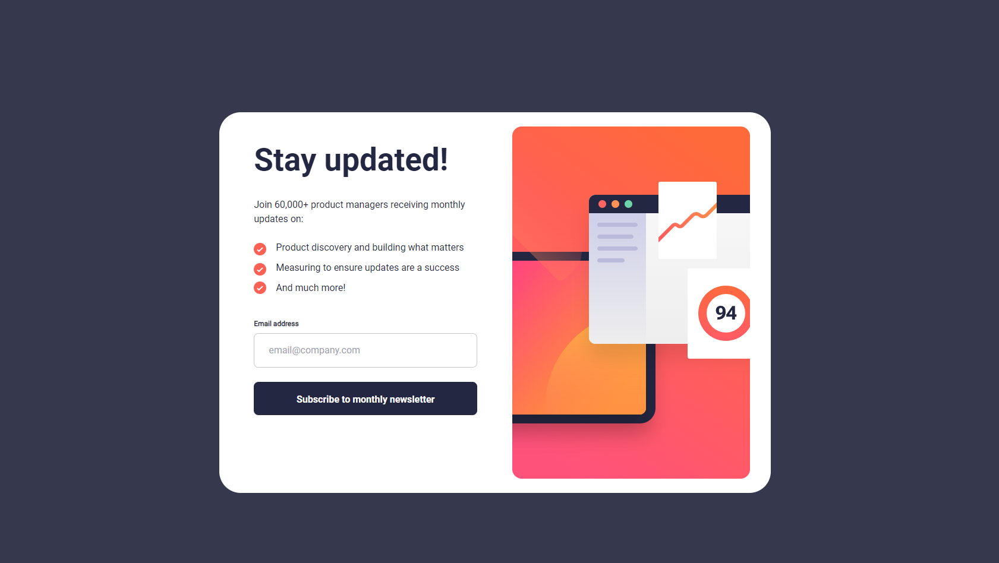
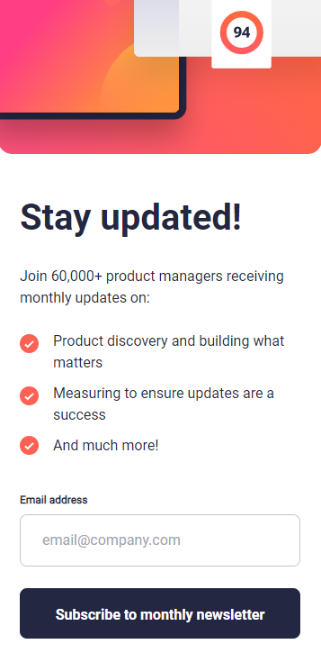

# Frontend Mentor - Newsletter sign-up form with success message solution

This is a solution to the [Newsletter sign-up form with success message challenge on Frontend Mentor](https://www.frontendmentor.io/challenges/newsletter-signup-form-with-success-message-3FC1AZbNrv). Frontend Mentor challenges help you improve your coding skills by building realistic projects. 

## Table of contents

- [Overview](#overview)
  - [The challenge](#the-challenge)
  - [Screenshot](#screenshot)
  - [Links](#links)
- [My process](#my-process)
  - [Built with](#built-with)
  - [What I learned](#what-i-learned)
  - [Continued development](#continued-development)

**Note: Delete this note and update the table of contents based on what sections you keep.**

## Overview

### The challenge

Users should be able to:

- Add their email and submit the form
- See a success message with their email after successfully submitting the form
- See form validation messages if:
  - The field is left empty
  - The email address is not formatted correctly
- View the optimal layout for the interface depending on their device's screen size
- See hover and focus states for all interactive elements on the page

### Screenshot
Desktop View

Mobile View  

### Links

- Solution URL: [GitHub Repo](https://github.com/DeviantSchemist/newsletter)
- Live Site URL: [Add live site URL here](https://your-live-site-url.com)

## My process
I started out bootstrapping the project in Vite. Deleted boilerplate code/files, then created 4 different component files based on what I thought could be separate components. The code is mostly JSX with Typescript. Using the Figma design file, I was able to get the exact measurements for the components. The CSS is entirely in Tailwind, as I found that to be the most efficient way to build out this component with my current workflow.

### Built with

- Semantic HTML5 markup
- CSS custom properties
- Flexbox
- Mobile-first workflow
- [React](https://reactjs.org/) - JS library
- [Typescript](https://www.typescriptlang.org/) - JS with types
- [Tailwind CSS](https://tailwindcss.com/) - CSS framework
- [Node Package Manager](https://www.npmjs.com/) - For the react-responsive package

### What I learned

While building this project, I used a Figma plugin in order to make my workflow more efficient. However, the plugin did not generate code for the components in a way that worked with my own code, so I had to rewrite it. I learned a lot about the way that state works in React when implementing the email validation.

### Continued development

I will continue to focus on responsive design. Components and websites always need to look good regardless of the user's screen size, and that is a skill that I strive towards improving.
